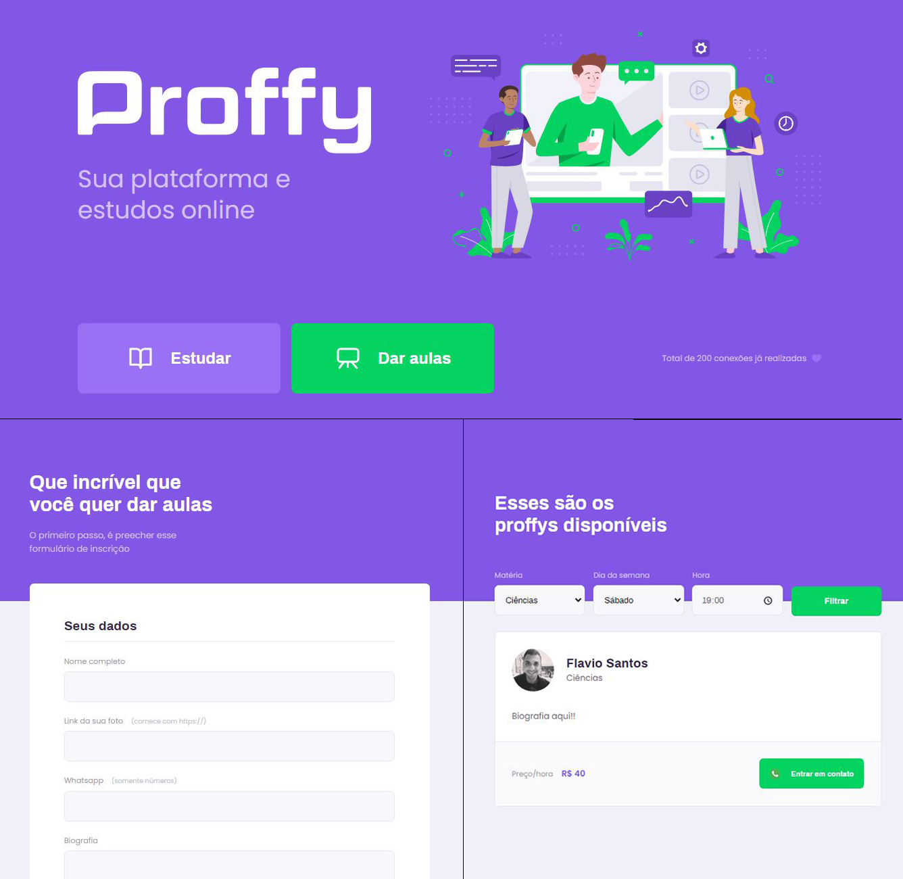

<h1 align="center">proffy-discovery</h1>

<p align="center">
  
</p>

## 📋 Índice

- [Sobre](#-Sobre)
- [Tecnologias utilizadas](#-Tecnologias-utilizadas)
- [Como executar o projeto](#-Como-executar-o-projeto)
- [Preview](#-Preview)

---

## 🎥 Preview

<p align="center">
  
</p>

---

## 📖 Sobre

Este é um projeto desenvolvido durante o Next Level Week, realizado pela **[@Rocketseat](https://github.com/Rocketseat)** durante os dias 03 a 09 
de Agosto de 2020.

A proposta do projeto é criar uma plataforma de estudos, onde professores poderão se cadastrar para dar aulas
e os alunos podem navegar pelo app encontrando o melhor horário, dia e matéria desejada para poder estudar.

---

## 🚀 Tecnologias utilizadas

No projeto foi utilizado as seguintes técnologias:

- HTML
- CSS
- JavaScrip
- Node.js
- Nunjuncks
- SQLite

---

## 💻 Como executar o projeto


```bash
# Clonar o repositório
https://github.com/FlavioSant/proffy-discovery.git

# Acessar o diretório
cd proffy-discovery

#Baixar as depêndencias
npm i

# Executar o app
npm run dev
```

Feito isso abra seu navegador e acesse: http://localhost:5500

---

Desenvolvido com :heart: por Flávio Santos. 
